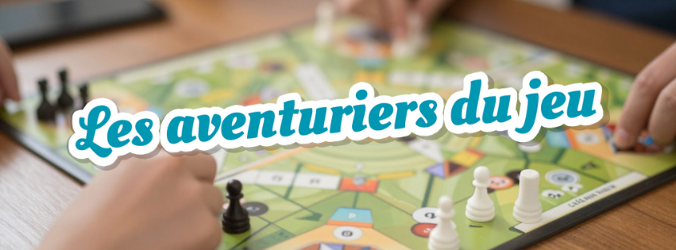


Votre association a une action sur la commune de Nouzerines et vous souhaitez la faire apparaître sur cette page ?

Envoyez-nous par mail à  un texte de présentation, une image si vous le souhaitez et vos coordonnées (adresse, téléphone, email, site internet, réseaux sociaux…).


### Association communale de chasse agréée de Nouzerines

À venir…

### Association des anciens combattants

À venir…

### Comité des fêtes

Actuellement en dormance, si vous souhaitez participer à son relancement, contactez la mairie qui vous mettra en relation.

### École en vies

Association des parents d'élèves du RPI, elle organise des événements et ventes pour récolter de l'argent permettant de 
soutenir les projets des trois écoles (Bussière-Saint-Georges, Nouzerines et Saint Marien).

Chaque année, une rando est organisée début avril, ouverte à tous.

Seuls les parents d'élèves peuvent être membres, mais tout le monde peut soutenir l'association — et donc les écoles — 
en participant aux événements.

Contact : ecolenvies@gmail.com

### Les aventuriers du jeu

L'association « Les aventuriers du jeu » organise des soirées jeux de société une fois par mois, le premier samedi du 
mois, en roulement sur les communes de Nouzerines, Bussière-Saint-Georges et Saint Marien.

Ça se passe de 18h à 23h, et c’est ouvert à tout public !

L’association apporte des jeux, et vous pouvez ramener les vôtres également. Chacun rapporte à boire et à manger, et on se partage tout ça, dans la joie et la bonne humeur !

L'ensemble des dates est visible sur le site internet de l'association : [https://lesaventuriersdujeu23.fr/](https://lesaventuriersdujeu23.fr/)

Si vous avez des questions, contactez nous par email : lesaventuriersdujeu23@gmail.com ou par téléphone : 06.29.64.18.53.

### Patrimoine Nouzerines 23

À venir…
