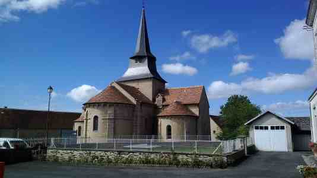
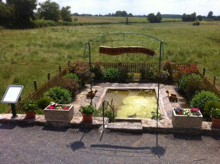
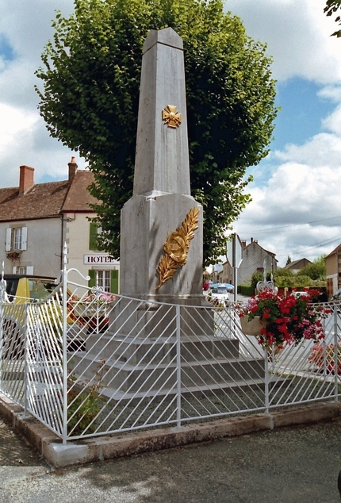
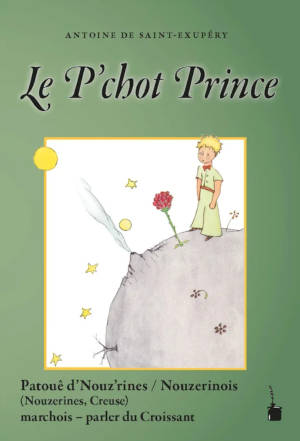

## Église

L'église Saint-Clair est une église romane datant de la fin du XIe siècle, début du XIIe. Une nef du XVIIIe siècle
vient agrandir l’édifice.

Son clocher est recouvert d'ardoises, ainsi que la nef. Le chevet et les absidioles sont recouverts 
de tuiles plates.

À l'intérieur, il subsiste des restes de peintures murales.

Le transept et le chevet ont été inscrits au titre des monuments historiques en 1963.

La partie la plus ancienne a été en travaux en 2011 et 2014. La rénovation comprenait la charpente
et la couverture du clocher, du chevet, des absides et des trois petites nefs ainsi que le ravalement
des murs extérieurs.

Pour découvrir les différentes étapes des travaux, vous pouvez télécharger le document pdf [ci-joint](renovation_eglise.pdf).

L'église n'est pas ouverte à la visite, un festival de musique y a lieu tous les étés, c'est
l'occasion de la découvrir.

## Fontaine Saint Clair

Cet édifice construit en pierre de pays servait essentiellement de lavoir public pour les habitants du bourg
et des villages voisins (Les Perrades, Chez Bottier, Chez Merlin).

Mais la légende révèle que coulait dans cette fontaine une eau miraculeuse pouvant guérir toute sorte de maux
aux yeux. Ainsi, ce site serait devenu lieu de procession où les malades venaient se frotter les yeux avec l'eau
de la fontaine…

## Halle



À venir…

## Monument aux morts

Le 27 août 1920, le conseil municipal choisit le monument dont l'éditeur est la société du Val d'Osne
(fonderie en Haute-Marne). Il décide que le monument sera érigé sur la place publique, face à la poste,
et de façon à être vu des différentes routes venant se croiser en cet endroit.

Le monument est réalisé en 1922 et inauguré le 18 juin de la même année.

## Le P'chot Prince

Traduction du Petit Prince de Saint-Exupéry en nouzerinois ou parler de Nouzerines. 
Les parlers du Croissant sont traditionnellement pratiqués au centre de la France, sur la frange Nord du Massif Central.

Faisant partie de la famille des langues gallo-romanes, ils présentent simultanément de nombreux traits caractéristiques
de l’occitan (limousin ou auvergnat) mais aussi des langues d’oïl (français, berrichon, bourbonnais ou
poitevin-saintongeais). 

Le nouzerinois ou parler de Nouzerines (Creuse), dans lequel est traduite cette version du 
Petit Prince, est une variété de la partie orientale du Croissant (aire linguistique du bourbonnais d’oc). Plus 
précisément, la traduction qui suit a été produite dans le parler du hameau du Mont (Le Mont).

Le livre est en vente à la mairie pour **15 €**.
