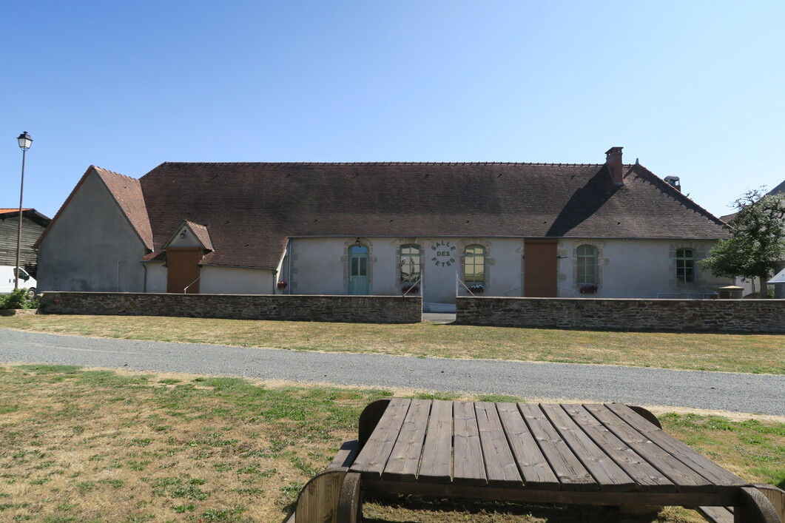
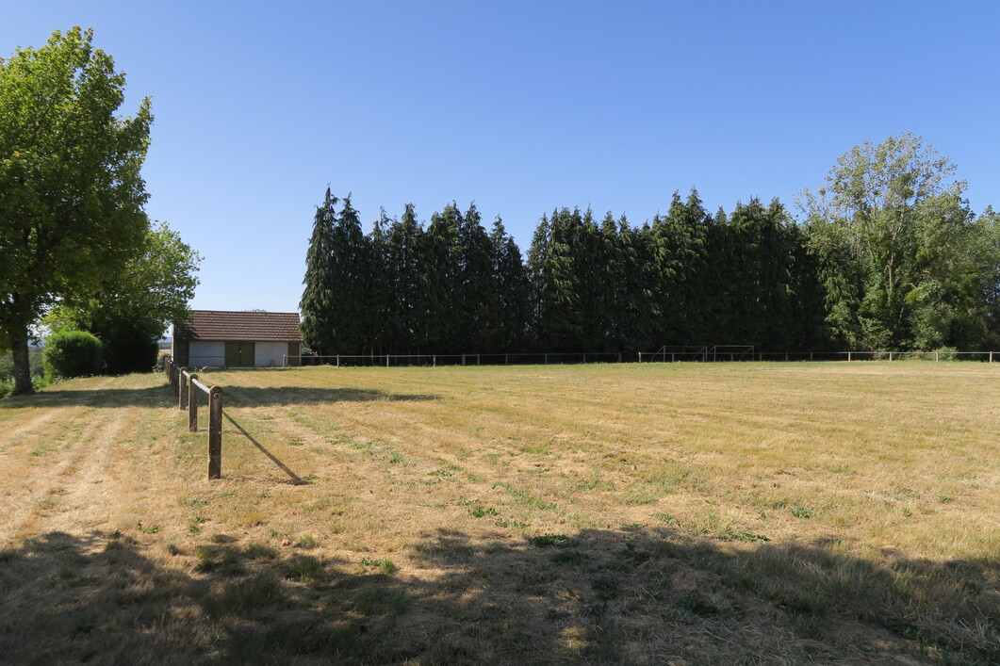

## Salle des fêtes

|                               |  Période du 01/05 au 30/09 (week-end)  |  Période du 01/10 au 30/04 (week-end)  | Vin d'honneur (quelques heures)  |
|:-----------------------------:|:--------------------------------------:|:--------------------------------------:|:--------------------------------:|
|  **Habitants de la commune**  |                 100 €                  |                 130 €                  |               70 €               |
|       **Hors commune**        |                 125 €                  |                 155 €                  |               90 €               |

Capacité de la salle : **170 personnes**

La location comprend la vaisselle et le matériel de cuisine. Celle-ci est équipée de fours, plaques électriques et gaz et d'une armoire réfrigérante. Il y a également une salle de plonge avec évier et lave-vaisselle.

Un second espace est accessible avec un bar et les sanitaires.



## Stade

Accès libre et gratuit aux habitants de la commune pour y pratiquer des activités sportives.

Les associations et les particuliers peuvent demander la privatisation du stade en mairie. La location est possible pour les entreprises, conditions disponibles en mairie.
